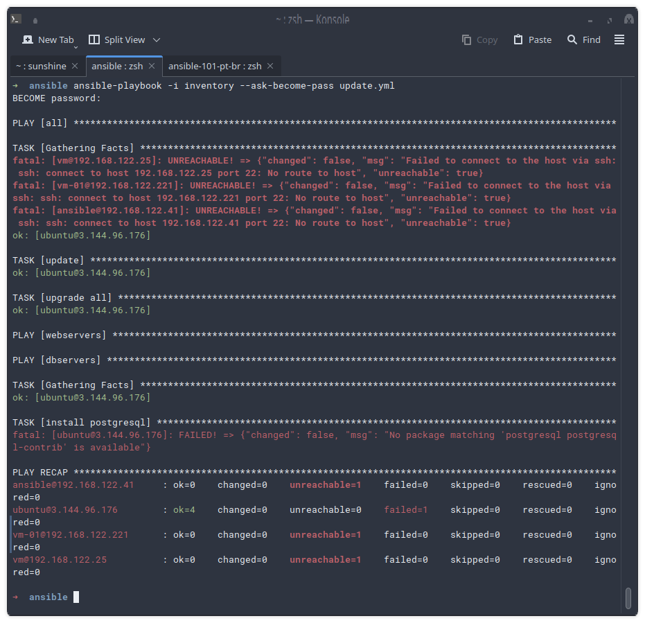
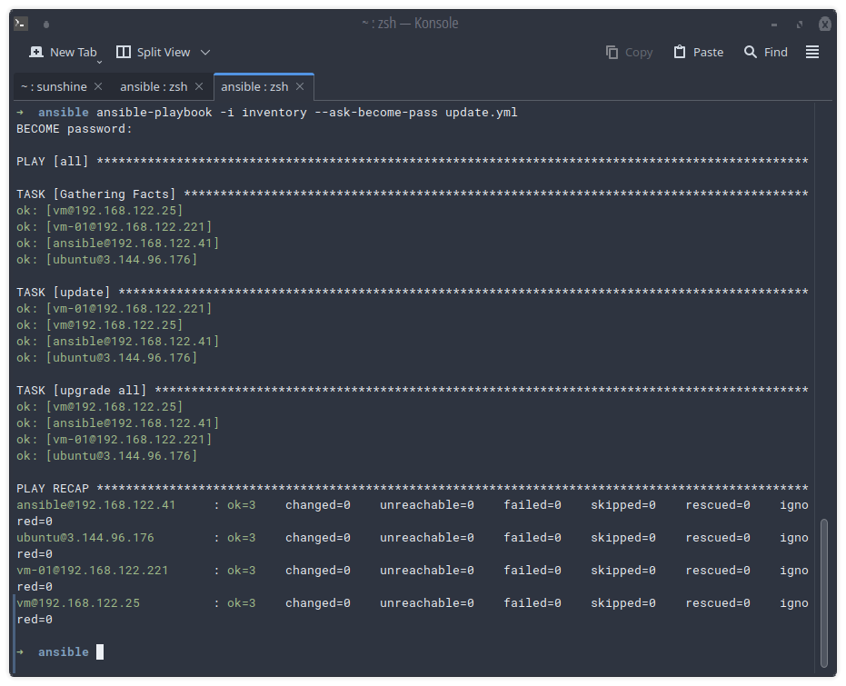
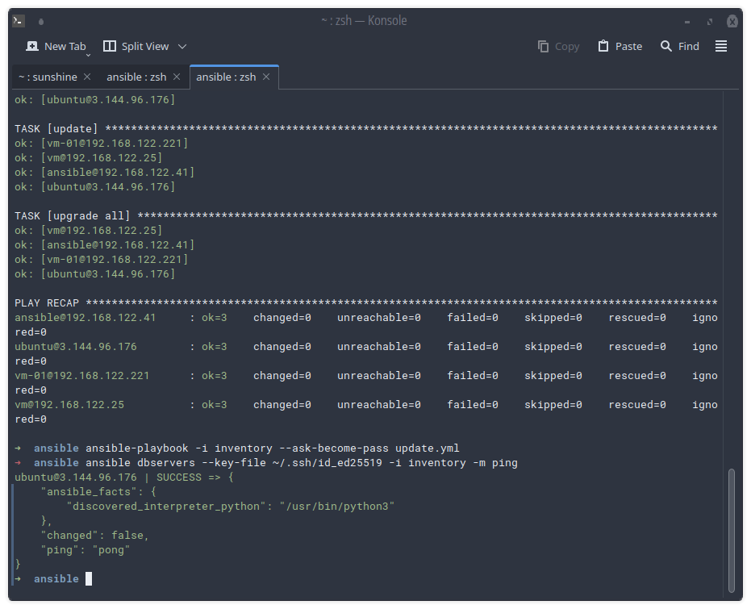
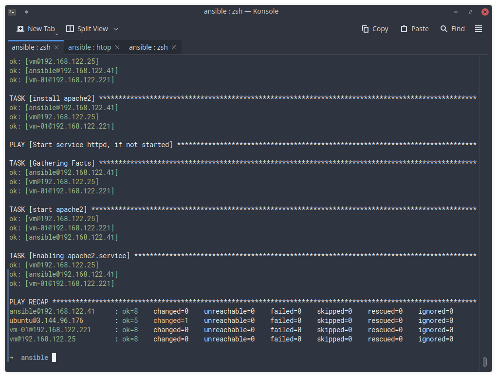

# Parte 2
## Criando um playbook

O playbook vai ser onde nós iremos colocar o passo a passo que nossos servidores devem seguir.
Nosso objetivo com o playbook atual é:

1: Fazer update do Ubuntu

2: Fazer upgrade dos pacotes

Nós podemos fazer ambas tarefas ao mesmo tempo, para isso podemos usar o comando 
```
sudo apt update && sudo apt upgrade
``` 
Assim não precisamos dividir em duas tarefas e nosso objetivo será concluido.

Nosso playbook inicial será esse `update.yml` , dentro dele devemos conter o seguinte conteudo:
```
- hosts: all
  become: true
  tasks:
  - name: update
    apt: update_cache=yes force_apt_get=yes cache_valid_time=3600
  - name: upgrade all
    apt: upgrade=dist force_apt_get=yes
```
### Quebrando o codigo
Quando usamos `hosts: all`, indicamos ao ansible para enviar as tarefas seguintes para todos os nossas maquinas no inventario.
O `become: true` serve para nós identificarmos como `sudo` nas maquinas.
Em `tasks:` criamos uma tarefa com um nome qualquer em `- name:`, e em seguida o modulo a qual vamos usar, no caso `apt` e definimos o que o apt vai fazer, no caso update do cache de mirrors e forçar o update do mesmo.
Em seguida temos outra tarefa que definie o upgrade dos pacotes.

Para testar essa tarefa usamos o seguinte comando, dentro de onde você crirou o arquivo `update.yml`.
```
ansible-playbook -i inventory --ask-become-pass update.yml
```



Como minhas maquinas virtuais estao desligadas, a unica maquina que retornou resultados foi a EC2 na AWS, por já estar atualizada, nenhuma mudança foi feita, por tanto o changed=0, caso alguma coisa tenha sido alterada, essa variavel vai indicar a quantidade de mudanças.
Agora vamos ligar as maquinas e checar os outputs com todas elas!

Devido a minha mudança de sistema operacional e ter saido do Windows para o Linux (i use Arch btw!), algumas coisas mudaram no meu inventory como os ips e usuarios, mas a base continua a mesma.

Com as maquinas ligadas agora temos o seguinte resultado:


Agora vamos dar um update no nosso `inventory` e deixar mais organizado.
```
[webservers]
vm@192.168.122.25
ansible@192.168.122.41
vm-01@192.168.122.221

[dbservers]
ubuntu@3.144.96.176

```
Simples assim, dentro de `[webservers]` colocamos os ips das nossas maquinas virtuais, e dentro de `dbservers` do nosso servidor de banco de dados, assim podemos separar nossos updates e/ou fazer instalaçoes pensando em cada equipamento. Se apenas o servidor de banco de dados precisar de atualização de um pacote para atualizar algum serviço rodando nele nós só precisamos rodar a atualização nele(s).

Vamos fazer um teste pingando o servidor dentro de `dbserver`
```
ansible dbservers --key-file ~/.ssh/id_ed25519 -i inventory -m ping
```



## Implementando as tarefas

Nosso objetivo é iniciar 4 servidores, onde 3 são maquinas onde nosso site vai está sendo hospedado e um vai ser nosso banco de dados, realisticamente, se quisermos servir um aplicativo onde precisamos ter backups ou failovers ou apenas servir nossos clientes de um servidor mais proximo essa é uma tarefa relistica.
Nossa ordem é:
- Atualizar o servidor
- Instalar o banco de dados, nesse caso o postgresql no servidor do banco
- Instalar o apache2 nos servidores de hospedage
- Iniciar o serviço nos servidores

Para isso vamos inicar o nosso playbook.
Criamos um arquivo chamado update.yml e agora vamos implementar 

```
---

- hosts: all
  become: true
  tasks:
  - name: update
    apt: update_cache=yes force_apt_get=yes cache_valid_time=3600
  - name: upgrade all
    apt: upgrade=dist force_apt_get=yes


- hosts: dbservers
  tasks:
  - name: Instalar postgresql
    apt: 
    name: postgresql postgresql-contrib

- hosts: webservers
  become: yes
  tasks:
  - name: instalar apache
    apt: name=apache2 update_cache=yes state=latest

- name: Iniciar apache se nao iniciado
  hosts: webservers
  become: true
  tasks:
    - name: Iniciar apache2
      systemd:
        name: apache2
        state: started

    - name: Habilitar apache2.service
      systemd:
        name: apache2
        enabled: yes  
```
## E aqui nosso resultado!
